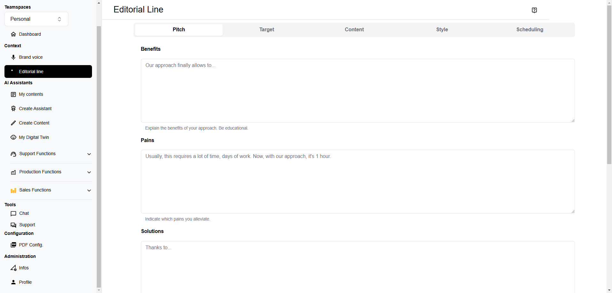

# Specification: Context Configuration

When you chat a little bit with an AI, you quickly notice generation is interesting but it is generic too. To make things more releveant, you ask it to detail its answer for such or such situation.

This situation IS the context. It enables the AI to use information in relation with your real needs.

The context is generally structured around a common and a specific one.
* Common context is about who you are, where do you come from, where you are going...
* Specific context is about who you are (as person), your role in the organization, you task and fianlly the situation (project, task...), what you are doing that and now.

The initial information you give to the AI, from which it will act to create the artefact and is what we we could call inspiration. Inspiration is, in a certain way, the ultimate context.

## Common Context

It is composed of generalities about your values, your project's pitch and also more detailed information about your audience, the style you want to use, all elements that will finally constitue an editorial line.

Veep currently provides you a form with the following informations you have to fill:
* Brand values
* Pitch: benefits, pains, products and solutions, competitive advantages
* Content: activity sector, keywords
* Audience: For who your projet solves pains and provide benefits you identified
* Elements of style: vocabulary, syntax, point of view, tone...

## Specific Context

Specific context may just be a more detailed common context.

TBD

