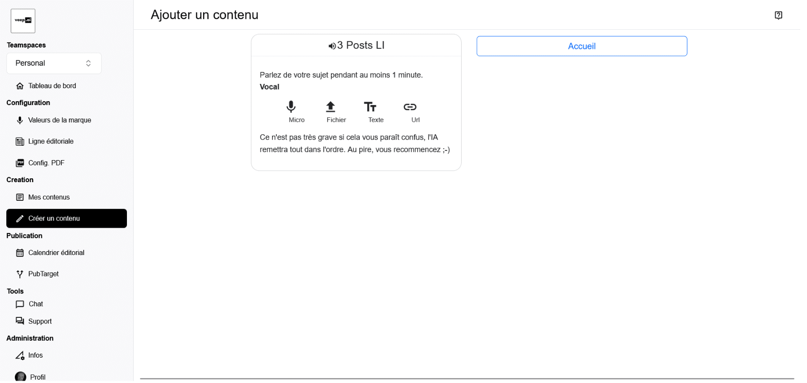
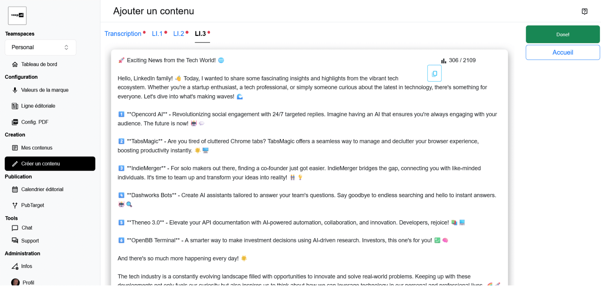

# Generation

## Input Configuration

Once the user has selected the assistant he wants to use, he must provide input with one of the following way:
* vocal
* file
* text
* url

## Generation Steps

After the user starts the generation process, a new window appears with all the elements that are going to be generated.

At each end of a generation step, a red dot appears and user can read and check generated content. By immediateley fixing erors, he avoids propagation of typo errors like with proper names, or can add, or insist, on some content that haven't been taken into account enough.  

Once errors have been fixed, user can continue generation process.