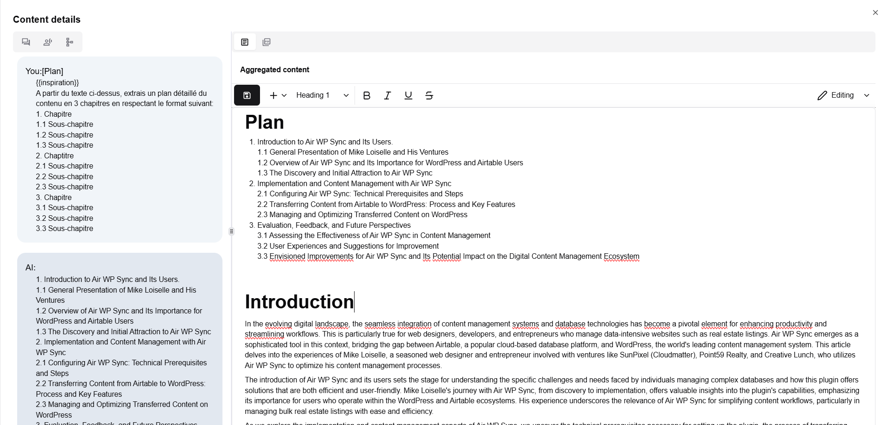

# Edition

Once process generation is over, the resulting content can be edited for verification and validation. The content can then be exported in PDF, published on social networks. You can also take it to Google Workplace, Sharepoint, Office 365 or Nextcloud by a simple Copy'n Past. 

The edition tool provides simple actions to focus on structure and provide tools to play basic AI instructions (make shorter, make longer, improve...) or more complex and customized one through assistants catalog usage.

