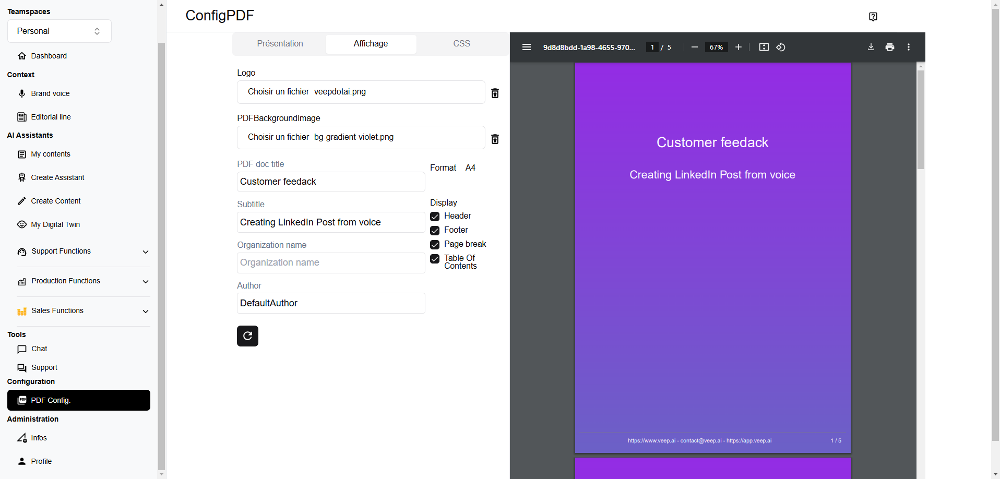

# Exportation PDF

Une fois que l'utilisateur est satisfait de son contenu, il peut exporter le contenu en tant que PDF et/ou le publier sur les réseaux sociaux.

L'utilisateur peut exporter le contenu en tant que PDF et personnaliser différentes parties :
* logo, arrière-plan
* en-tête, pied de page
* titre, auteur, version...

