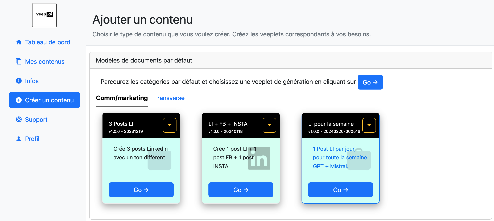
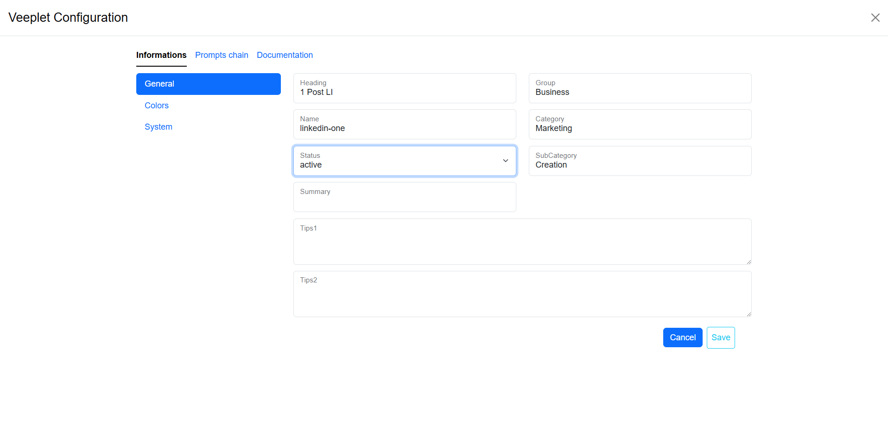

# Catalogue des Assistants

Un assistant est un ensemble d'instructions, décomposé en invites, qui sont exécutées, pour le moment, l'une après l'autre, prenant en entrée une ou plusieurs sorties précédentes et fournissant elles-mêmes une nouvelle sortie. Un assistant est une chaîne d'invites et peut également être appelé agent, chaîne d'invites, flux de travail...

Le Catalogue des Assistants est un ensemble d'assistants composés dynamiquement à partir des catégories et sous-catégories indiquées dans les assistants.

Un assistant est construit à partir d'un formulaire basé sur 3 parties :
* Informations générales : titre, nom, version, date de création, mais aussi catégorie et sous-catégorie utilisées pour classer l'assistant dans le catalogue 
* Chaîne d'invites : l'ensemble des invites à traiter pour obtenir la sortie à partir de l'entrée fournie
* Documentation : l'assistant doit contenir une documentation pour expliquer ce qu'il fait, comment il fonctionne, comment il peut être personnalisé en option

Le constructeur d'assistants doit être autonome afin que l'utilisateur puisse décider de l'utiliser ou non. La description, la documentation... peuvent contenir des URLs vers des tutoriels, des captures d'écran, des vidéos...

