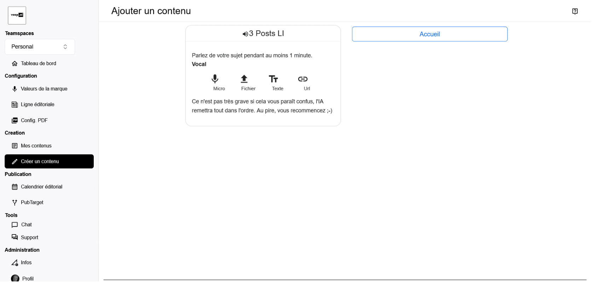

# Génération

## Configuration de l'entrée

Une fois que l'utilisateur a sélectionné l'assistant qu'il souhaite utiliser, il doit fournir une entrée de l'une des manières suivantes :
* vocal
* fichier
* texte
* url

## Étapes de génération

Après que l'utilisateur ait démarré le processus de génération, une nouvelle fenêtre apparaît avec tous les éléments qui vont être générés.

À chaque fin d'une étape de génération, un point rouge apparaît et l'utilisateur peut lire et vérifier le contenu généré. En corrigeant immédiatement les erreurs, il évite la propagation d'erreurs typographiques comme avec les noms propres, ou peut ajouter ou insister sur un contenu qui n'a pas été pris en compte suffisamment.

Une fois que les erreurs ont été corrigées, l'utilisateur peut continuer le processus de génération.
