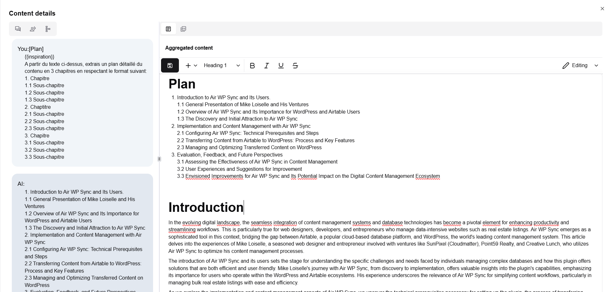

# Édition

Une fois le processus de génération terminé, le contenu résultant peut être édité pour vérification et validation. Le contenu peut ensuite être exporté au format PDF, publié sur les réseaux sociaux. Vous pouvez également l'emmener vers Google Workspace, Sharepoint, Office 365 ou Nextcloud par un simple copier-coller.

L'outil d'édition propose des actions simples pour se concentrer sur la structure et fournir des outils pour jouer des instructions d'IA basiques (rendre plus court, rendre plus long, améliorer...) ou des instructions plus complexes et personnalisées grâce à l'utilisation du catalogue d'assistants.
